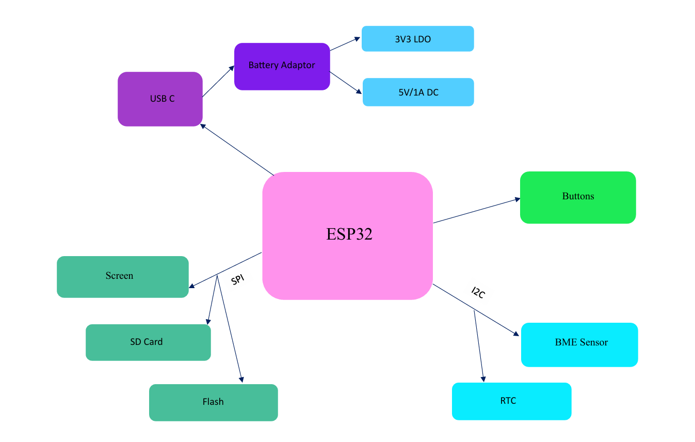

# TSC-OpenBook
# Descriere funcționalitate hardware

Proiectul se bazează pe microcontroller-ul **ESP32-C6**, care gestionează comunicarea cu toate componentele externe și senzorii conectați. Acest microcontroller oferă conectivitate **Wi-Fi** și **Bluetooth**, dar și suport pentru interfetele **SPI**, **I2C** și **UART**. Este conectat la 3V3 printr-un regulator de tensiune **LDO**, care primește energie de la o baterie **Li-Po** de 3.7V. 

Afisarea informațiilor se face utilizând un **display E-Paper** conectat prin **interfața SPI**, care are un consum redus de energie, fiind activ doar la actualizările ecranului. Informațiile afișate vor include data, ora, valorile senzorilor etc. 

Monitorizarea mediului se face cu ajutorul senzorului **BME688**, care măsoară temperatura, umiditatea și presiunea atmosferică, comunicând cu microcontroller-ul prin magistrala **I2C**. Modulul **RTC DS3231** este conectat și el la I2C și menține ora și data exactă, chiar și atunci când sistemul este oprit.

Prin **portul USB-C** se face alimentarea sistemului, care este conectat la circuitul de încărcare a bateriei utilizând **MCP73831**. Acesta controlează încărcarea bateriei Li-Po. Tensiunea va fi stabilită la **3.3V** pentru alimentarea senzorilor și a microcontroller-ului. Circuitul **MAX17048** este folosit pentru a monitoriza nivelul încărcării bateriei și furnizează informații despre tensiune și starea de încărcare prin I2C.

Consumul de energie este gestionat de ESP32-C6, care poate intra în **modul de consum redus**, permițând o durată lungă de viață a bateriei. Consumul în regim activ variază în funcție de sarcinile și componentele active în acel moment.

Pentru stocare, sistemul va folosi o **memorie externă NOR Flash**, conectată prin **SPI**, dar va exista și un slot pentru **card SD**, care va fi folosit pentru a loga local datele. Butoanele sunt conectate la **GPIO-uri** și vor fi folosite pentru resetare, bootare și alte acțiuni.

---

# Schema bloc

# Descriere pini ESP32-C6

Pinii microcontroller-ului **ESP32-C6** sunt utilizați în cadrul a cinci categorii:

## 1. Interfața SPI
Este folosită pentru comunicarea componentelor care necesită viteze mari de transfer. Pinii utilizați sunt:
- **IO0**: linia **MOSI** unde microcontroller-ul va trimite date către perifericele SPI.
- **IO1**: linia **MISO** unde ESP32-C6 va primi date de la cardul SD.
- **IO2**: linia **SCK** care va genera semnalul de ceas pentru sincronizarea SPI.
- **IO3**: linia **CS** pentru memoria **Flash NOR**.
- **IO4**: linia **CS** pentru display-ul **E-paper**.
- **IO5**: linia **CS** pentru slotul de card **SD**.
- **IO6, IO7, IO8**: pentru semnalele de control ale **E-Paper**-ului: **reset**, **busy**, **data/command (DC)**. Acești pini sunt utilizați pentru a evita conflictele cu alte interfețe și permit o rutare eficientă a traseelor pe placă.

## 2. Interfața I2C
Este folosită pentru a conecta senzorii de mediu și circuitele de monitorizare a tensiunii sau a timpului. Această interfață va conecta componentele: **BME688**, **MAX17048**, **DS3231**. Pinii folosiți sunt:
- **IO15**: linia **SCL**, folosită pentru semnalul de ceas.
- **IO16**: linia **SDA**, care va transmite date bidirecțional între microcontroller și perifericele I2C. Acești pini sunt aleși pentru a nu se suprapune cu cei de la SPI sau UART și pentru a permite extinderea prin **Qwiic**.

## 3. Interfața UART
Este folosită pentru **debugging**, comunicare serială sau conectare la module externe. Pinii utilizați sunt:
- **IO17**: **TXD**, linia de ieșire a datelor de la ESP32 către PC sau consolă.
- **IO18**: **RXD**, linia de intrare a datelor către ESP32. Acești pini sunt utili în faza de dezvoltare pentru testare, dar pot fi folosiți și în aplicațiile finale, dacă UART nu este necesar.

## 4. Pini GPIO
Sunt folosiți pentru butoanele **boot**, **reset** sau **change**. Pinii utilizați sunt:
- **IO9**: este folosit pentru **BOOT** și permite intrarea în modul de programare.
- **EN**: este pinul hardware **RESET** al ESP32-C6.
- **IO10, IO11**: sunt utilizați pentru butoane suplimentare, care au diverse acțiuni în aplicație. Acești pini au fost aleși pentru că sunt disponibili în schema de referință ESP32-C6 și nu sunt partajați cu perifericele.

## 5. Alimentare
Pinii de alimentare sunt:
- **3V3**: este intrarea de alimentare stabilizată la 3.3V, provenind din regulatorul LDO alimentat de la bateria **Li-Po**.
- **GND**: conexiunea de masă.

# Bill of Materials

| CNT | VAL | Device | Package | Parts | PURCHASE | DATASHEET |
| --- | ----- | ------ | ------- | ----- | ------------ | ------------- |
| 1 |  | ADAFRUIT_LEDCHIP-LED0603 | 0603 | CHG_LED | https://www.digikey.com/en/products/detail/w%C3%BCrth-elektronik/150060RS75000/4489901 | https://www.we-online.com/components/products/datasheet/150060RS75000.pdf |
| 1 | 0.1uF/50V | ESP32_WROVER_EAGLE-LTSPICE_C0402 | 0402 | EPD_C3 | https://www.digikey.com/en/products/detail/samsung-electro-mechanics/CL05B104KB5NNNC/11696318 | https://weblib.samsungsem.com/mlcc/mlcc-ec-data-sheet.do?partNumber=CL05B104KB5NNN |
| 1 | 0.47 | ESP32_WROVER_EAGLE-LTSPICE_RR0402 | 0402 | R3 | https://www.digikey.com/en/products/detail/panasonic-electronic-components/ERJ-2BQJR47X/5647384 | https://industrial.panasonic.com/cdbs/www-data/pdf/RDN0000/AOA0000C313.pdf |
| 1 | 100K | ESP32_WROVER_EAGLE-LTSPICE_RR0402 | 0402 | R_PWRUSB | https://www.digikey.com/en/products/detail/panasonic-electronic-components/ERJ-2RKF1003X/192081 | https://industrial.panasonic.com/cdbs/www-data/pdf/RDA0000/AOA0000C304.pdf |
| 8 | 100nF | ESP32_WROVER_EAGLE-LTSPICE_C0402 | 0402 | C1, C2, C3_USB, C5, C7, C8, C9, C_DELAY | https://www.digikey.com/en/products/detail/samsung-electro-mechanics/CL05B104KP5NNNC/3886660 | https://mm.digikey.com/Volume0/opasdata/d220001/medias/docus/609/CL05B104KP5NNNC_Spec.pdf |
| 1 | 100uF | RCL_CPOL-EUCT3528 | 3528 | C_TANT | https://ro.mouser.com/ProductDetail/KEMET/T491B107M006AT?qs=U312oeP%2FpiHOgyk6KO2m0g%3D%3D | https://ro.mouser.com/datasheet/2/447/KEM_T2005_T491-3316937.pdf
| 16 | 10K | ESP32_WROVER_EAGLE-LTSPICE_RR0402 | 0402 | R1, R1_PINH1, R1_PINH2, R2-PINH1, R2_PINH2, R4, R5, R6, R7, R8, R9, R10, R_BOOT, R_CHANGE, R_CL1, R_RESET | https://www.digikey.com/en/products/detail/panasonic-electronic-components/ERJ-2RKF1002X/192073 | https://industrial.panasonic.com/cdbs/www-data/pdf/RDA0000/AOA0000C304.pdf |
| 1 | 10uF | ESP32_WROVER_EAGLE-LTSPICE_C0402 | 0402 | C6 | https://www.digikey.com/en/products/detail/samsung-electro-mechanics/CL05A106MP5NUNC/3887108 | https://mm.digikey.com/Volume0/opasdata/d220001/medias/docus/2614/CL05A106MP5NUNC_Spec.pdf |
| 1 | 112A-TAAR-R03_ATTEND | 112A-TAAR-R03_ATTEND |  | J4 | https://www.digikey.ro/en/products/detail/attend-technology/112A-TAAR-R03/17633923 | https://www.attend.com.tw/data/download/file/112A-TAAR-R03_Spec.pdf |
| 1 | 15 | ESP32_WROVER_EAGLE-LTSPICE_RR0402 | 0402 | R_CAPACITOR | https://www.digikey.com/en/products/detail/panasonic-electronic-components/ERJ-2RKF15R0X/192142 | https://industrial.panasonic.com/cdbs/www-data/pdf/RDA0000/AOA0000C304.pdf |
| 1 | 1uF | ESP32_WROVER_EAGLE-LTSPICE_C0402 | 0402 | C4 | https://www.digikey.com/en/products/detail/samsung-electro-mechanics/CL05A105KO5NNNC/3886725 | https://mm.digikey.com/Volume0/opasdata/d220001/medias/docus/609/CL05A105KO5NNNC_Spec_5-2-19.pdf |
| 9 | 1uF/50V | ESP32_WROVER_EAGLE-LTSPICE_C0402 | 0402 | EPD_C1, EPD_C2, EPD_C4, EPD_C5, EPD_C6, EPD_C7, EPD_C8, EPD_C9, EPD_C10 | https://www.digikey.com/en/products/detail/murata-electronics/GRM155R61H105KE05D/13531808 | https://search.murata.co.jp/Ceramy/image/img/A01X/G101/ENG/GRM155R61H105KE05-01A.pdf |
| 1 | 2.2 | ESP32_WROVER_EAGLE-LTSPICE_RR0402 | 0402 | R2 | https://www.digikey.com/en/products/detail/panasonic-electronic-components/ERJ-2GEJ2R2X/282078 | https://api.pim.na.industrial.panasonic.com/file_stream/main/fileversion/1242 |
| 1 | 200 | ESP32_WROVER_EAGLE-LTSPICE_RR0402 | 0402 | R1_BAT | https://www.digikey.com/en/products/detail/panasonic-electronic-components/ERJ-2RKF2000X/192215 | https://industrial.panasonic.com/cdbs/www-data/pdf/RDA0000/AOA0000C304.pdf |
| 2 | 20V/4.2A/52mO/1.4W | ESP32_WROVER_SPARKFUN-DISCRETESEMI_MOSFET_PCH-DMG2305UX-7 |  | Q1, Q2 | https://www.digikey.ro/en/products/detail/diodes-incorporated/DMG2305UX-7/4340667 | https://www.diodes.com/assets/Datasheets/DMG2305UX.pdf |
| 1 | 2K | ESP32_WROVER_EAGLE-LTSPICE_RR0402 | 0402 | R2_BAT | https://www.digikey.com/en/products/detail/panasonic-electronic-components/ERJ-2RKF2001X/192194 | https://industrial.panasonic.com/cdbs/www-data/pdf/RDA0000/AOA0000C304.pdf |
| 5 | 4.7uF | ESP32_WROVER_EAGLE-LTSPICE_C0402 | 0402 | C1_BAT, C1_BAT1, C2_BAT, C2_BAT1, C4_USB | https://www.digikey.com/en/products/detail/samsung-electro-mechanics/CL05A475KQ5NRNC/3887139 | https://mm.digikey.com/Volume0/opasdata/d220001/medias/docus/41/CL05A475KQ5NRNC_Spec.pdf |
| 1 | 4.7uF/25V | ESP32_WROVER_EAGLE-LTSPICE_C0402 | 0402 | C3 | https://www.digikey.com/en/products/detail/murata-electronics/GRM155C61E475ME15D/16821133 | https://search.murata.co.jp/Ceramy/image/img/A01X/G101/ENG/GRM155C61E475ME15-01A.pdf |
| 2 | 5k1 | ESP32_WROVER_EAGLE-LTSPICE_RR0402 | 0402 | R1_USB, R2_USB | https://www.digikey.com/en/products/detail/panasonic-electronic-components/ERJ-2GEJ512X/147044 | https://api.pim.na.industrial.panasonic.com/file_stream/main/fileversion/1242 |
| 1 | 68uH | 744043680IND_4828-WE-TPC_WRE |  | L1 | https://www.digikey.de/en/products/detail/w%C3%BCrth-elektronik/744043680/1638515?srsltid=AfmBOoreM6iTR1zfidcAYx5855uFKN_t-1dK5Y4hJLHk64FUsesZV3qH | https://www.we-online.com/components/products/datasheet/744043680.pdf |
| 1 | BD5229G-TR | BD5229G-TR |  | U6 | https://www.digikey.com/en/products/detail/rohm-semiconductor/BD5229G-TR/658502 | https://www.rohm.com/datasheet?p=BD5229G&dist=Digi-key&media=referral&source=digi-key.com&campaign=Digi-key |
| 1 | BME688 | ESP32_WROVER_BME680_BME680 |  | U8 | https://www.digikey.ro/en/products/detail/bosch-sensortec/BME688/13681261 | https://www.bosch-sensortec.com/media/boschsensortec/downloads/datasheets/bst-bme688-ds000.pdf |
| 3 | BUTTON_CUSYOMV1 | BUTTON_CUSYOMV1 |  | BOOT_BUTTON, CHANGE_BUTTON, RESET_BUTTON |  |  |
| 1 | CPH3225A | CPH3225A |  | C_SUPERCAP | https://www.digikey.com/en/products/detail/seiko-instruments/CPH3225A/8692444 | https://mm.digikey.com/Volume0/opasdata/d220001/medias/docus/6537/rev05-CPHCPM.pdf |
| 1 | DS3231SN# | DS3231SN# |  | U3 | https://www.digikey.com/en/products/detail/analog-devices-inc-maxim-integrated/DS3231SN/1197576 | https://www.analog.com/media/en/technical-documentation/data-sheets/DS3231.pdf |
| 1 | ESP32-C6-WROOM-1-N8 | ESP32-C6-WROOM-1-N8 |  | U1 | https://www.digikey.com/en/products/detail/espressif-systems/ESP32-C6-WROOM-1-N8/17728866 | https://www.espressif.com/sites/default/files/documentation/esp32-c6-wroom-1_wroom-1u_datasheet_en.pdf |
| 1 | ESP32C6_VARISTORCN1812 | ESP32C6_VARISTORCN1812 |  | PFMF.050.1 | https://www.digikey.com/en/products/detail/schurter-inc/PFMF-050-2/1731348 | https://us.schurter.com/en/datasheet/typ_PFMF.pdf |
| 2 | ESP32_WROVER_AVX---SD0805S020S1R0 | ESP32_WROVER_AVX---SD0805S020S1R0 |  | D2, D7 | https://www.digikey.gr/en/products/detail/kyocera-avx/SD0805S020S1R0/3749517 | https://datasheets.kyocera-avx.com/schottky.pdf |
| 1 | FH34SRJ-24S-0.5SH_99_ | FH34SRJ-24S-0.5SH_99_ |  | J1 | https://www.digikey.com/en/products/detail/hirose-electric-co-ltd/FH34SRJ-24S-0-5SH-99/5132529 | https://www.hirose.com/en/product/document?clcode=CL0580-1253-0-99&productname=FH34SRJ-12S-0.5SH(99)&series=FH34SRJ&documenttype=SpecSheet&lang=en&documentid=0000414526 |
| 1 | MAX17048G+T10 | MAX17048G+T10 |  | U2 | https://www.digikey.com/en/products/detail/analog-devices-inc-maxim-integrated/MAX17048G-T10/3758921 | https://datasheets.maximintegrated.com/en/ds/MAX17048-MAX17049.pdf |
| 3 | MBR0530 | MBR0530 |  | D3, D4, D5 | https://eu.mouser.com/ProductDetail/Micro-Commercial-Components-MCC/MBR0530-TP?qs=KFo7JewZbUECRHkxGanrdg%3D%3D&srsltid=AfmBOopI5EY-Qmh6fu8QJtXckZ14Imu1WB2G5-0En3D3mZ6aqi4jmsQ2 | https://eu.mouser.com/datasheet/2/258/MBR0520_MBR0580_SOD123_-2492194.pdf |
| 1 | MCP73831 | ESP32_WROVER_SPARKFUN-IC-POWER_MCP73831 |  | U7 | https://www.digikey.com/en/products/detail/microchip-technology/MCP73831T-2ACI-OT/964301 | https://ww1.microchip.com/downloads/en/DeviceDoc/MCP73831-Family-Data-Sheet-DS20001984H.pdf |
| 6 | PGB1010603MR | PGB1010603MR |  | D6, D8, D9, D10, D11, D12 | https://www.digikey.com/en/products/detail/littelfuse-inc/PGB1010603MR/715755 | https://www.littelfuse.com/assetdocs/pulseguard-esd-suppressors-pgb1-datasheet?assetguid=8a337998-d54d-466b-be4e-dc5bcd1f9321 |
| 1 | QWIIC_RIGHT_ANGLE | QWIIC_CONNECTORJS-1MM |  | J3 | https://www.sparkfun.com/qwiic-jst-connector-smd-4-pin-horizontal.html | https://cdn.sparkfun.com/assets/parts/1/2/2/8/9/Qwiic_Connector_Datasheet.pdf |
| 1 | SAMACSYS_PARTS_USB4110-GF-A | SAMACSYS_PARTS_USB4110-GF-A |  | J2 | https://www.digikey.ro/en/products/detail/gct/USB4110-GF-A/10384547 | https://gct.co/files/specs/usb4110-spec.pdf?v=6b2a6292-70a5-4bd5-a7e5-0f3fe03e015f |
| 1 | SI1308EDL-T1-GE3 | SI1308EDL-T1-GE3 |  | Q3 | https://www.digikey.com/en/products/detail/vishay-siliconix/SI1308EDL-T1-GE3/4876435 | https://www.vishay.com/docs/63399/si1308edl.pdf |
| 1 | USBLC6-2SC6Y | USBLC6-2SC6Y |  | D1 | https://www.digikey.com/en/products/detail/stmicroelectronics/USBLC6-2SC6Y/2819177 | https://www.st.com/content/ccc/resource/technical/document/datasheet/group0/94/15/6c/58/ba/91/46/42/DM00055262/files/DM00055262.pdf/jcr:content/translations/en.DM00055262.pdf |
| 1 | W25Q512JVEIQ | W25Q512JVEIQ |  | U4 | https://www.digikey.com/en/products/detail/winbond-electronics/W25Q512JVEIQ/10244706 | https://www.winbond.com/resource-files/W25Q512JV%20SPI%20RevB%2006252019%20KMS.pdf |
| 1 | XC6220A331MR-G | XC6220A331MR-G |  | U5 | https://www.digikey.in/en/products/detail/torex-semiconductor-ltd/XC6220A331MR-G/10165775 | https://product.torexsemi.com/system/files/series/xc6220.pdf |
